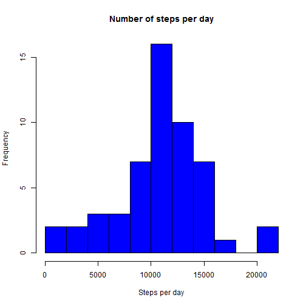
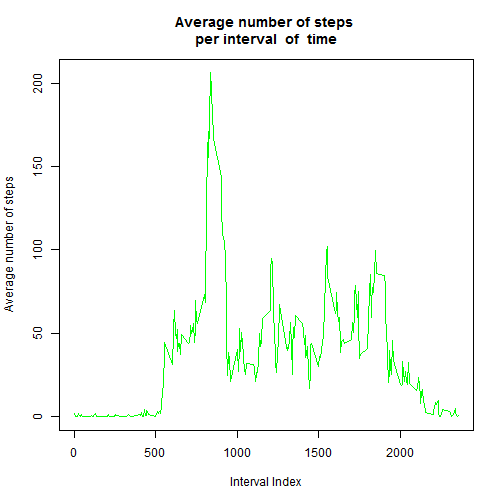
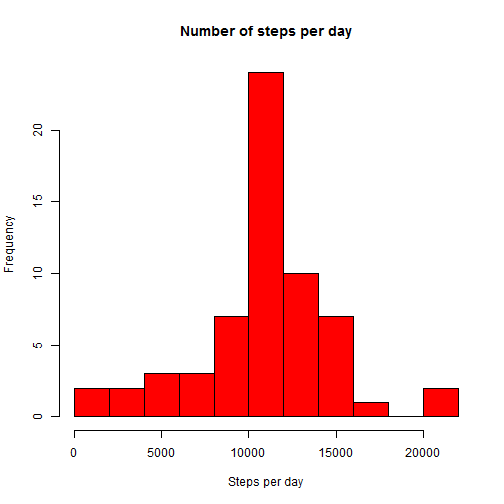
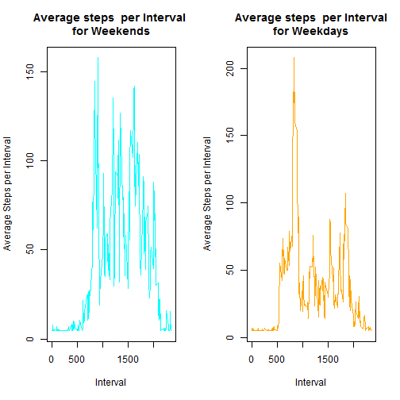

## Loading and preprocessing the data


```r
library(lattice)
#These commands read the data into R
setwd("C:/Users/juane_000/Desktop")
x<-read.csv("activity.csv")
names(x)
```

```
## [1] "steps"    "date"     "interval"
```

## What is mean total number of steps taken per day?


```r
y<-tapply(x$steps,as.factor(x$date),sum)
hist(y,xlab="Steps per day",breaks=10,main="Number of steps per day",col="blue")
```

 

```r
t<-mean(y,na.rm=TRUE)
u<-median(y,na.rm=TRUE)
```

The mean is 1.0766 &times; 10<sup>4</sup> and the median is 10765

## What is the average daily activity pattern?


```r
z<-tapply(na.rm=TRUE,x$steps,as.factor(x$interval),mean)
plot(names(z),z,type="l",xlab="Interval Index",ylab="Average number of steps",main="Average number of steps 
per interval  of  time",col="green")
```

 

```r
v<-names(z[z==max(z)])[1]
```

The maximum average daily activity occurs on the interval 835, which has the maximum average number of steps.
In other words, the maximum average daily activity occurs from 8:35 AM to 9:00 AM.

## Imputing missing values 


```r
a<-length(x$steps[is.na(x$steps)])
```

There are 2304 missing values in this dataset.

The following algorithm will modify the dataset by replacing the missing values( of a missing day) with the median of 10765 (obtained previously) divided by the number of intervals in that day (288 intervals) so that the sum of the missing values of the respective missing day sum up to 10765.


```r
     for(i in 1:length(as.factor(levels(x$date)))){
       w<-x[x$date==as.factor(levels(x$date))[i],]
         if(length(w[,1][!is.na(w[,1])])==0){
           for(j in 1:length(w[,1])){
             w[j,1]<-u/length(w[,1])}}else{
             for(j in 1:length(w[,1])){
               w[j,1]<-x[x$date==as.factor(levels(x$date))[i],][j,1]}}
               x[x$date==as.factor(levels(x$date))[i],]<-w}
```

Now, the histogram looks like this:


```r
c<-tapply(x$steps,as.factor(x$date),sum)
hist(c,xlab="Steps per day",breaks=10,main="Number of steps per day",col="red")
```

 

```r
d<-mean(c,na.rm=TRUE)
e<-median(c,na.rm=TRUE)
```

The histogram looks similar to the one obtained with missing values. The resulting mean is 1.0766 &times; 10<sup>4</sup> and the resulting median is 1.0765 &times; 10<sup>4</sup>. These results are equal to the previous results obtained with missing values.

## Are there differences in activity patterns between weekdays and weekends?

Let's add another variable to our list which specifies if a given day is weekday or weekend.


```r
 q<-rep(0,length(x$date))
     x<-cbind(x,q)
     for(i in 1:length(as.factor(levels(x$date)))){
       w<-x[x$date==as.factor(levels(x$date))[i],]
      for(j in 1:length(w[,1])){
       r<-weekdays(as.POSIXlt(w$date))
       if(r[j]=="Saturday" |r[j]=="Sunday"){w[j,4]<-"Weekend"}else{w[j,4]<-"Weekday"} 
      }
       x[x$date==as.factor(levels(x$date))[i],]<-w}
```

Now, let's compute the mean steps per interval for weekdays and weekend days:


```r
f<-x[x$q!="Weekday",]
g<-x[x$q!="Weekend",]
m<-tapply(f$steps,f$interval,mean)
n<-tapply(g$steps,g$interval,mean)
par(mfrow=c(1,2))
plot(names(m),m,type="l",xlab="Interval",ylab="Average Steps per Interval",main="Average steps  per Interval 
for Weekends",col="cyan")
plot(names(n),n,type="l",xlab="Interval",ylab="Average Steps per Interval",main="Average steps  per Interval
for Weekdays",col="orange")
```

 
